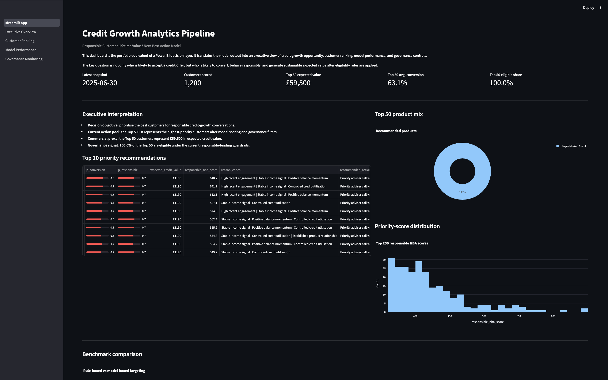
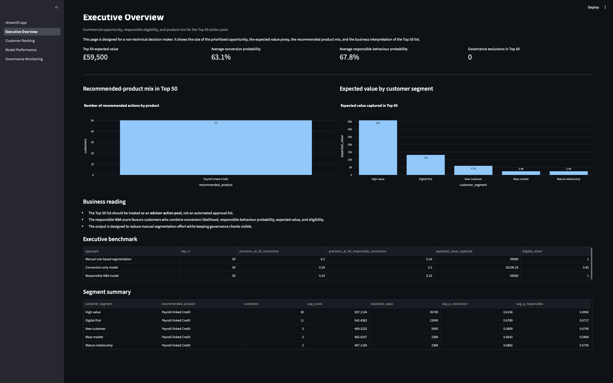
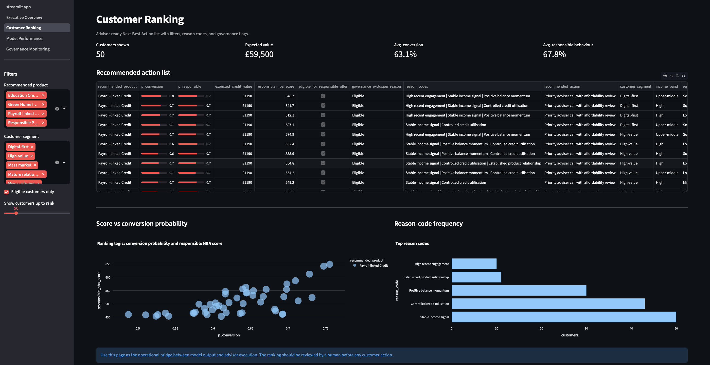
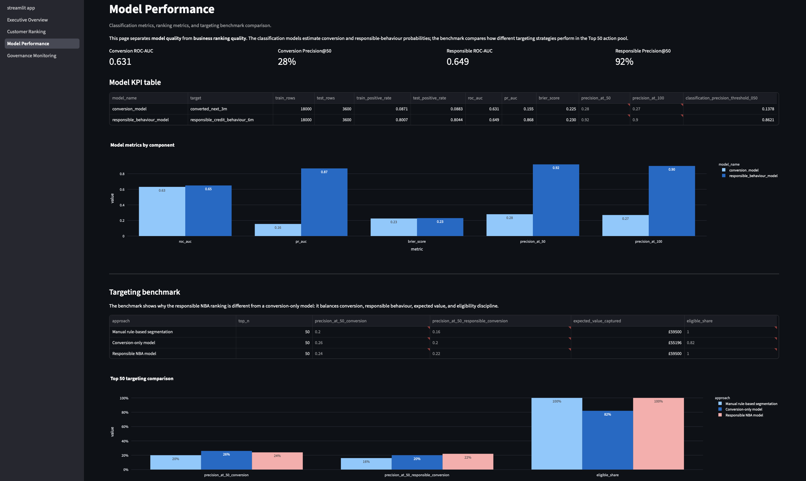
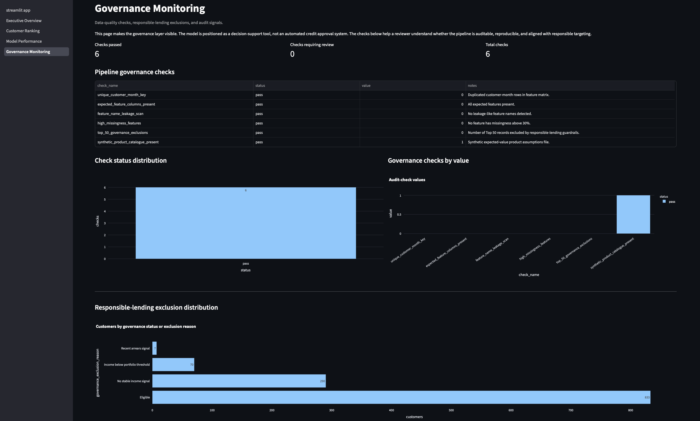

# Credit Growth Analytics Pipeline

## Responsible Customer Lifetime Value / Next-Best-Action Model

[](https://github.com/albertojromerot/credit-growth-analytics-pipeline/actions/workflows/validate.yml)
[](https://www.python.org/)
[](dashboard/)
[](data/synthetic/)
[](LICENSE)
[](CHANGELOG.md)
[](docs/executive_summary.md)

| Status area | Current state |
|---|---|
| Build | Validated through GitHub Actions |
| Version | v1.0.0 public release |
| Python | 3.11 |
| Dashboard | Streamlit |
| Data | Synthetic financial-services data |
| Licence | MIT |
| Use case | Responsible credit growth / Next-Best-Action |

This repository demonstrates how customer analytics, responsible credit behaviour modelling, and expected value estimation can be combined into an auditable **Next-Best-Action** decision pipeline for financial services.

The goal is not only to predict who is likely to convert. The goal is to prioritise customers who are likely to:

1. accept a suitable credit offer;
2. show responsible credit behaviour after conversion; and
3. generate sustainable expected value for the business.

```text
Responsible NBA Score =
P(conversion)
× P(responsible credit behaviour)
× Expected Credit Value
× Eligibility / governance filters
```

> **Disclaimer:** this is a public project using synthetic data only. It does not represent real customers, real credit decisions, real financial products, or an automated lending-approval process. See [`DISCLAIMER.md`](DISCLAIMER.md).

---

## View the Final Results Dashboard

The Streamlit dashboard is the final visual output layer of the project. It is the equivalent of a Power BI dashboard and is designed for both technical and non-technical review.

After running the pipeline, launch the dashboard from the repository root:

```bash
python -m streamlit run dashboard/streamlit_app.py
```

The dashboard shows:

1. **Main Dashboard** — executive summary, Top 10 recommendations, benchmark comparison, and governance snapshot.
2. **Executive Overview** — commercial opportunity, expected value, product mix, and segment view.
3. **Customer Ranking** — advisor-ready Next-Best-Action list with reason codes and eligibility flags.
4. **Model Performance** — ROC-AUC, PR-AUC, Precision@50, benchmark comparison, and expected-value comparison.
5. **Governance Monitoring** — data-quality checks, responsible-lending exclusions, and audit signals.

---

## Dashboard Preview

### Main Dashboard



### Executive Overview



### Customer Ranking



### Model Performance



### Governance Monitoring



---

## Quickstart: validate the repository

A reviewer can validate the project from the terminal using the commands below.

Run these commands from the repository root: the folder that contains `README.md`, `requirements.txt`, `src`, `dashboard`, `data`, `docs`, and `tests`.

```bash
python3 -m venv .venv
source .venv/bin/activate
python -m pip install --upgrade pip
python -m pip install -r requirements.txt
python -m src.run_pipeline
python -m pytest tests -q
python -m streamlit run dashboard/streamlit_app.py
```

Expected validation signals:

```text
Pipeline completed. Check the outputs/ and dashboard/data/ folders.
4 passed
```

Reviewer shortcuts are also available through the `Makefile`:

```bash
make install
make validate
make dashboard
```

For troubleshooting and reviewer checks, see [`docs/reproducibility_guide.md`](docs/reproducibility_guide.md).

---

## 1. Business Problem

Financial institutions need to grow their credit portfolios while protecting customers, controlling risk, and focusing commercial teams on the most valuable opportunities.

Traditional campaign segmentation often relies on static rules such as income band, tenure, age group, or current product ownership. This project reframes the problem as a governed decision-ranking system:

> Which customer should receive which next-best credit action, based on conversion likelihood, responsible credit behaviour, expected value, and eligibility rules?

---

## 2. Portfolio Relevance

This project demonstrates the ability to:

- translate a commercial problem into an analytical decision system;
- build a reproducible Python pipeline;
- generate safe synthetic financial-services data;
- validate models using ranking and business metrics, not only accuracy;
- design a visualisation layer equivalent to a Power BI dashboard;
- document governance, responsible lending filters, and monitoring requirements;
- validate the repository automatically using GitHub Actions.

---

## 3. Solution Overview

The pipeline contains five main layers:

| Layer | Purpose | Example output |
|---|---|---|
| Synthetic data layer | Safe customer, behaviour, product, and outcome data | `customers.csv`, `monthly_behaviour.csv` |
| Feature engineering layer | Build customer-month predictive features | product depth, balance trends, engagement |
| Modelling layer | Estimate conversion and responsible behaviour | `p_conversion`, `p_responsible` |
| Value and ranking layer | Combine probabilities with expected value | `responsible_nba_score` |
| Visualisation layer | Executive and analytical dashboards | ranking, value, governance, performance |

---

## 4. Repository Structure

```text
credit-growth-analytics-pipeline/
│
├── README.md
├── LICENSE
├── DISCLAIMER.md
├── CHANGELOG.md
├── CITATION.cff
├── Makefile
├── requirements.txt
├── .gitignore
│
├── .github/
│   └── workflows/
│       └── validate.yml
│
├── data/
│   └── synthetic/
│
├── src/
│   ├── config.py
│   ├── data_generation.py
│   ├── preprocessing.py
│   ├── features.py
│   ├── modelling.py
│   ├── scoring.py
│   ├── validation.py
│   ├── governance.py
│   └── run_pipeline.py
│
├── dashboard/
│   ├── README.md
│   ├── streamlit_app.py
│   ├── data/
│   └── pages/
│       ├── 1_Executive_Overview.py
│       ├── 2_Customer_Ranking.py
│       ├── 3_Model_Performance.py
│       └── 4_Governance_Monitoring.py
│
├── outputs/
├── docs/
│   ├── assets/
│   │   └── screenshots/
│   ├── architecture_diagram.md
│   ├── executive_summary.md
│   ├── technical_note.md
│   ├── ml_model_specification.md
│   ├── model_card.md
│   ├── reproducibility_guide.md
│   └── visualisation_layer.md
│
└── tests/
    ├── test_features.py
    ├── test_scoring.py
    └── test_no_leakage.py
```

---

## 5. Synthetic Data Design

The project uses synthetic data only. No real customer data is included.

| Table | Purpose |
|---|---|
| `customers.csv` | Customer demographics and static attributes |
| `monthly_behaviour.csv` | Customer-month behavioural signals |
| `credit_products.csv` | Product catalogue and expected value assumptions |
| `credit_outcomes.csv` | Historical conversion and responsible behaviour labels |
| `treatment_log_sample.csv` | Sample intervention tracking for future learning |

---

## 6. Modelling Approach

The analytical design uses three complementary components:

| Component | Objective |
|---|---|
| Conversion propensity | Estimate `P(customer converts within next 3 months)` |
| Responsible credit behaviour | Estimate `P(no serious deterioration / arrears within next 6 months)` |
| Expected credit value | Estimate expected revenue minus funding cost, operating cost, and expected loss |

Final ranking score:

```text
responsible_nba_score = p_conversion × p_responsible × expected_value × eligibility_flag
```

The final output is an advisor-ready ranked list with recommended action, reason codes, and governance flags.

Full model details are available in [`docs/ml_model_specification.md`](docs/ml_model_specification.md).

---

## 7. Validation Strategy

The project compares three approaches:

| Approach | Description |
|---|---|
| Rule-based segmentation | Manual logic based on income, tenure, product ownership, or balance |
| Conversion-only model | Ranks customers by probability of accepting an offer |
| Responsible NBA model | Ranks by conversion × responsible behaviour × expected value |

Current synthetic benchmark:

| Approach | Precision@50 conversion | Precision@50 responsible conversion | Expected value captured | Eligible share |
|---|---:|---:|---:|---:|
| Manual rule-based segmentation | 20% | 16% | £59,500 | 100% |
| Conversion-only model | 26% | 20% | £55,196 | 82% |
| Responsible NBA model | 24% | 22% | £59,500 | 100% |

Model metrics from the current synthetic run:

| Model | ROC-AUC | PR-AUC | Brier score | Precision@50 |
|---|---:|---:|---:|---:|
| Conversion model | 0.631 | 0.155 | 0.225 | 28% |
| Responsible behaviour model | 0.649 | 0.868 | 0.230 | 92% |

---

## 8. Visualisation Layer

The repository includes a Streamlit dashboard designed as the equivalent of a Power BI dashboard.

The dashboard presents:

1. **Executive Overview** — portfolio opportunity, expected value, Top 50 summary, and action distribution.
2. **Customer Ranking** — ranked Next-Best-Action list with probabilities, score, product, reason codes, and eligibility flags.
3. **Model Performance** — ROC-AUC, PR-AUC, Precision@50, benchmark comparison, and expected-value comparison.
4. **Governance Monitoring** — data-quality checks, leakage tests, and responsible-lending exclusions.

The dashboard can be launched with:

```bash
python -m streamlit run dashboard/streamlit_app.py
```

---

## 9. Automated Validation

The repository includes a GitHub Actions workflow:

```text
.github/workflows/validate.yml
```

The workflow runs automatically on pushes and pull requests to `main`. It:

1. installs Python dependencies;
2. runs the full reproducible pipeline;
3. runs the automated tests;
4. uploads generated validation outputs as workflow artefacts.

This allows a technical reviewer to confirm that the repository is reproducible and testable.

---

## 10. Governance, Responsible Lending and Disclaimer

This project includes a governance layer covering:

- temporal train/test splitting;
- leakage prevention;
- customer eligibility filters;
- responsible lending exclusions;
- missingness checks;
- duplicate customer-month key checks;
- model-card documentation;
- treatment-log feedback loop;
- monitoring and drift checks.

The model supports prioritisation and decision intelligence. It is not intended to automate final credit approval. For use restrictions and interpretation notes, see [`DISCLAIMER.md`](DISCLAIMER.md).

---

## 11. Expected Outputs

| Output | Purpose |
|---|---|
| `dashboard/data/model_metrics.csv` | Model KPIs |
| `dashboard/data/nba_ranked_customers.csv` | Advisor-ready customer ranking |
| `dashboard/data/benchmark_comparison.csv` | Rule-based vs model-based comparison |
| `dashboard/data/governance_checks.csv` | Audit and governance results |
| `outputs/` | Generated pipeline outputs for reproducibility |

---

## 12. Documentation

| Document | Purpose |
|---|---|
| `docs/reproducibility_guide.md` | Terminal commands and validation checklist |
| `docs/technical_note.md` | Technical explanation |
| `docs/executive_summary.md` | Non-technical summary |
| `docs/ml_model_specification.md` | Full ML model specification |
| `docs/model_card.md` | Purpose, limitations, validation, governance |
| `docs/architecture_diagram.md` | Mermaid architecture diagram |
| `docs/visualisation_layer.md` | Dashboard design and KPI layout |
| `DISCLAIMER.md` | Synthetic-data and non-credit-advice disclaimer |
| `CHANGELOG.md` | Release history |
| `CITATION.cff` | Citation metadata |
| `LICENSE` | MIT licence |

---

## 13. Status

Current status: **v1.0.0 public release**.

Implemented:

1. reproducible core pipeline;
2. dashboard-ready outputs;
3. Streamlit dashboard;
4. governance checks;
5. model specification;
6. validation guide;
7. GitHub Actions workflow;
8. dashboard screenshots;
9. MIT licence;
10. disclaimer;
11. changelog;
12. citation metadata;
13. Makefile command shortcuts.

Recommended future enhancements:

1. deploy a live Streamlit Community Cloud demo;
2. add SHAP or permutation-importance explanations;
3. add HistGradientBoostingClassifier as a challenger model;
4. add a formal GitHub release tag for `v1.0.0`;
5. add repository topics and a GitHub social preview image.
