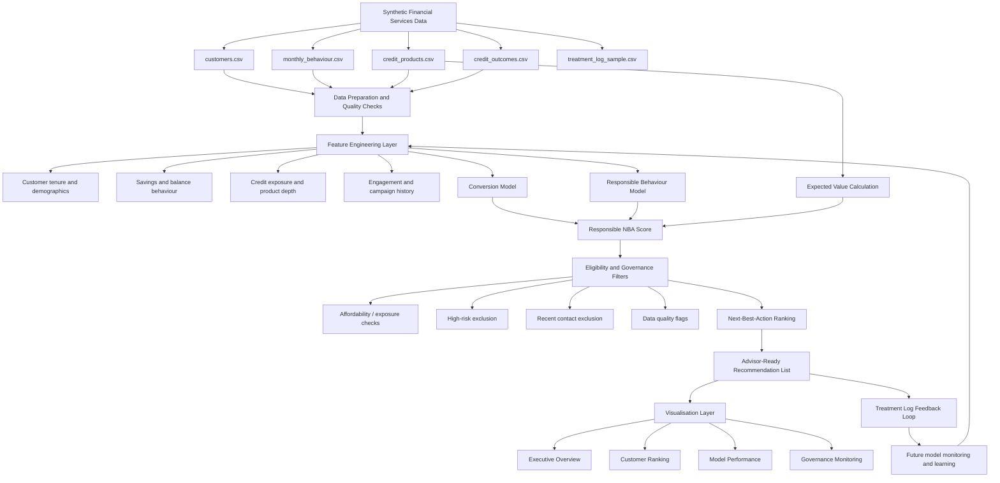

# Architecture Diagram Draft

This diagram shows the planned flow of the Credit Growth Analytics Pipeline.

## Interpretation

The project is designed as a closed-loop analytics product:

1. synthetic data is generated safely;
2. customer-month features are engineered;
3. conversion, responsible behaviour, and expected value are estimated;
4. customers are ranked using a responsible Next-Best-Action score;
5. governance filters protect against unsuitable targeting;
6. the dashboard translates model outputs into business decisions;
7. the treatment log enables future learning from interventions.
